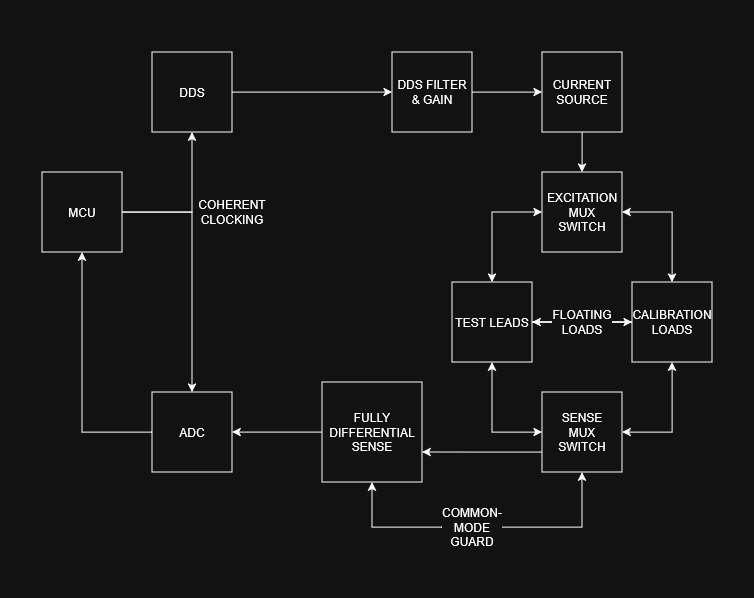
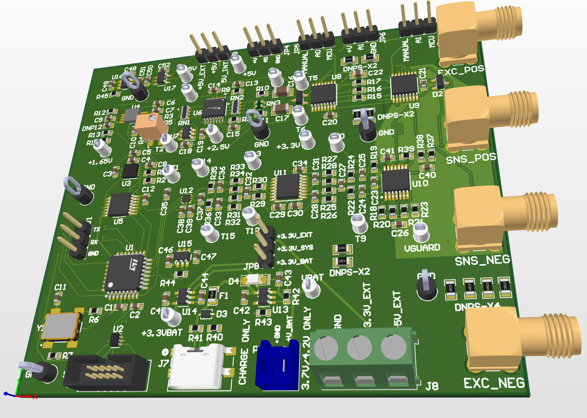

# Bioimpedance Spectrometer Development Board
*Bench/research instrument. Not a certified medical device. Not for patient, diagnostic, or clinical use.*

## Overview

A discrete multi-frequency tetrapolar bioimpedance spectroscopy system. The intent of this project is to evaluate several bioimpedance current-source topologies from the literature via simulation, and validate the strongest candidate on a development board. Benchmarking results will be performed first against a resistor phantom and later on tissue. The board includes a low-noise, precision, analog front-end, and an STM32G0 microcontroller for digital lock-in filtering via a Goertzel filter, as well as the synchronous control of the excitation and sense chains.

## Quick Links

- [Schematic (PDF)](CAD/Outputs/Schematic%20PDF/BioZSpec.pdf)
- [PCB 3D Model (STEP)](CAD/Outputs/ExportSTEP/BioZ.step)
- [Bill of Materials](CAD/Outputs/BOM/Bill%20of%20Materials-BioZSpec.xlsx)

## Board Features

- **Measurement** - Multi-frequency bioimpedance spectroscopy. Software adjustable up to 250 kHz (default frequencies 10/50/100/250 kHz). Precision and repeatability designed to 0.25Ω magnitude accuracy and 0.2° phase accuracy. Can be pushed to 400 kHz.
- **Electrodes** - Tetrapolar (Kelvin connected) stainless steel dry contacts
- **Current Source** - Custom mirrored enhanced Howland current pump, 100µA RMS target. Simulated to <0.1% current deviation up to 10kOhm load at 250 kHz.
- **Sense Chain** - Fully differential, common-mode guarded, anti-aliasing filter
- **ADC** - 14-bit, 1 MSPS differential SAR ADC 
- **Excitation Waveform** - 16 MHz DDS-generated sine wave
- **Demodulation** - Software lock-in demodulation (I/Q) via Goertzel filter, coherent excitation/sampling/reference with a 48 MHz oscillator 
- **Calibration** - Three on-board precision complex loads for drift correction
- **Power** - Rechargeable LiPo cell via USB-C. 5V boost charge pump for excitation. Software-controlled high-side switch for analog chain for power saving
- **MCU** - STM32G071

## Roadmap

- [x] Research
- [x] Requirements
- [x] Simulation / Schematic Capture
- [x] Layout
- [x] Board & Parts Acquisition 
- [ ] Firmware (*in progress*)
- [ ] Assembly
- [ ] Calibration Jigs
- [ ] Bring-up
- [ ] Design Verification & Benchmarking
- [ ] Final Documentation
